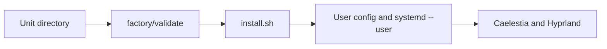

# ArchCustomWidgets

> Installable widgets and services for an existing [Caelestia](https://github.com/caelestia-dots/shell) (HyDE 3.x) desktop on Arch Linux, Hyprland, and Wayland.

[](https://archlinux.org/) [](https://hyprland.org/) [](https://wayland.freedesktop.org/) [](https://github.com/caelestia-dots/shell)   [](LICENSE)

[Overview](#overview) · [Install one unit](#install-one-unit) · [Catalog](#catalog) · [Requirements--warnings](#requirements--warnings) · [Keybinds](#keybinds-are-manual) · [Docs](#docs)

## Overview

ArchCustomWidgets is a small factory for people who already run Caelestia on Arch/Hyprland and want self-contained additions: Waybar modules, Quickshell widgets, and systemd user services. Each unit carries its own manifest, installer, source, and documentation. Installers copy files into user configuration; they do not create symlinks or edit Hyprland keybinds.

The normal flow is: choose a unit, read its README and manifest, run the lightweight factory check, install it, then make any manual desktop wiring the unit requires.



**[Open the detailed architecture overview](docs/architecture-overview.html)** for the same flow and its VPN exception.

## Install one unit

```bash
# From the repository root: check one unit's manifest contract and Bash syntax
factory/validate widgets/clipboard-rofi

# Install it
cd widgets/clipboard-rofi
./install.sh
```

`factory/validate` is a static check: it verifies the manifest contract, expected unit files, and Bash syntax. It does not perform an install, start services, verify a theme, or replace a manual smoke test. Read the selected unit README before running its installer.

## Remove a unit

From that unit directory, run:

```bash
./install.sh --remove
```

The installer removes only its own installed files. Unit READMEs document exceptions and retained user data.

## Catalog

| Unit | Type | Purpose |
|---|---|---|
| [`wallpaper`](services/wallpaper/README.md) | Service | Wallhaven fetcher, rofi selector, and wallpaper-driven color scheme update. |
| [`vpn-surfshark`](services/vpn-surfshark/README.md) | Service | Surfshark quick-toggle with WireGuard and nftables integration. |
| [`quickshell-watchdog`](services/quickshell-watchdog/README.md) | Service | Restarts Caelestia Quickshell when it is not running. |
| [`scheme-rotator`](widgets/scheme-rotator/README.md) | Widget | Cycles Caelestia color schemes. |
| [`waybar-power`](widgets/waybar-power/README.md) | Widget | Lock, shutdown, logout, and reboot Waybar modules. |
| [`waybar-theme`](widgets/waybar-theme/README.md) | Widget | Rotates Waybar styles and restarts Waybar. |
| [`clipboard-rofi`](widgets/clipboard-rofi/README.md) | Widget | Rofi picker for cliphist clipboard history. |
| [`task-notes`](widgets/task-notes/README.md) | Widget | Quick capture, batched note classification, and a Caelestia Tasks tab. |
| [`recruiter-drafts`](widgets/recruiter-drafts/README.md) | Widget | Creates reviewable Gmail application drafts from a job posting. |

## Requirements & warnings

- Base desktop: Arch Linux, Hyprland/Wayland, and an existing Caelestia (HyDE 3.x) setup.
- Tooling: Bash 5+ and Python 3; units may also need `systemd --user` or their own dependencies.
- Dependencies and configuration vary by unit. Treat each linked `manifest.json` and unit README as authoritative before installation.
- Some widgets require manual Waybar or Quickshell wiring. `task-notes` installs a Caelestia dashboard override; its README explains the update trade-off.
- `vpn-surfshark` is the exception to the user-level model: it uses `sudo` and system files. It requires a private `/etc/wireguard/surfshark.conf` and a reviewed, machine-appropriate `src/nftables.conf`; neither setup can be inferred from this repository.

## Keybinds are manual

No installer writes your Hyprland configuration. Check [`docs/keybinds-map.md`](docs/keybinds-map.md) first, then follow the selected unit README and reload Hyprland after editing your own Lua keybind layer.

| Unit | Documented binding |
|---|---|
| wallpaper | `Ctrl+Super+T` fetch; `Shift+Super+T` select |
| scheme-rotator | `Super+Alt+T` |
| clipboard-rofi | `Super+V` |
| task-notes | `Ctrl+Super+G` |
| recruiter-drafts | `Super+H` |

These are documented bindings, not automatically applied bindings. Your local map is the collision check.

## Restore after a format

After rebuilding the base desktop and installing each unit's dependencies, restore the repository and run its checks before reinstalling:

```bash
git clone https://github.com/Luisarg03/ArchCustomWidgets.git ~/ArchCustomWidgets
cd ~/ArchCustomWidgets
factory/validate
for u in widgets/* services/*; do echo "==> $u"; (cd "$u" && ./install.sh); done
```

Do **not** run the loop unchanged until `vpn-surfshark` is prepared: supply its private WireGuard configuration, provide and review its gitignored `src/nftables.conf`, and expect `sudo` for its system-level files. Wire keybinds manually afterwards.

## Docs

- **[Architecture overview](docs/architecture-overview.html)** — detailed editorial diagram of validation, installation, and runtime targets.
- [`docs/archcustomwidgets.md`](docs/archcustomwidgets.md) — technical reference.
- [`docs/keybinds-map.md`](docs/keybinds-map.md) — local keybind map and verification command.
- [`AGENTS.md`](AGENTS.md) — unit contract and project rules.
- [`openspec/specs/`](openspec/specs/) — canonical capability specifications.
- [MIT License](LICENSE).
