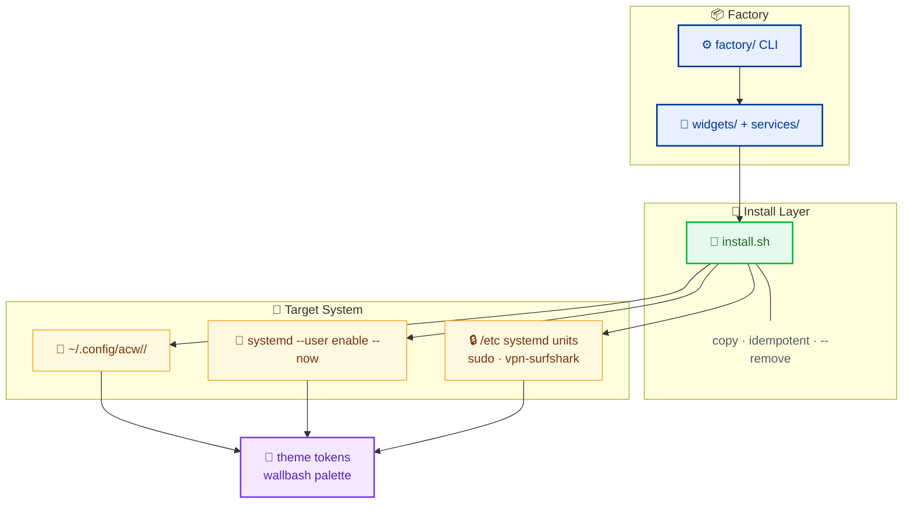

# ArchCustomWidgets

> Factory of installable **widgets & services** extending Caelestia (HyDE 3.x) on Arch Linux / Hyprland / Wayland.

<div align="center">

       

</div>

---

## What it does

Spec-driven factory: every unit starts as an **OpenSpec proposal** → spec → factory scaffold → validated install. Each unit is self-contained: `manifest.json`, scripts, styles, an idempotent `install.sh`, and a `README.md`.

### Features

- **Copy, never symlinks** — plain file copies into `~/.config`, idempotent, reversible (`--remove` leaves no trace).
- **No hardcoded colors** — every unit consumes the active wallbash / Caelestia palette via CSS variables or env tokens.
- **Bash first** — no frameworks, no build step; python3 only as JSON helper when bash genuinely cannot express it.
- **Spec-driven lifecycle** — proposals, delta specs with `SHALL`/`MUST` requirements, factory scaffolding.
- **Sudo only where needed** — system-level files (vpn-surfshark) prompt for sudo; everything else is user-level.

---

## Architecture



---

## Units

| Unit | Type | What it does | Notes |
|---|---|---|---|
| `wallpaper` | service | Wallhaven downloader + rofi wallpaper selector + auto-theme pipeline (systemd `.path` → matugen + scheme set) | Keybinds `Ctrl+Super+T`, `Shift+Super+T`, `Ctrl+Shift+T` — wire manually |
| `scheme-rotator` | widget | Rotates the active color scheme | Keybind `Super+Alt+T` — wire manually |
| `waybar-power` | widget | Power menu module: lock / power / quit / reboot | |
| `waybar-theme` | widget | Theme switcher module for waybar | |
| `clipboard-rofi` | widget | Rofi clipboard manager | Keybind `Super+V` — wire manually |
| `task-notes` | widget | Quick note capture (`Ctrl+Super+G`) + batched LLM classification (title/type/priority/tags/due) + Caelestia Tasks tab | Needs `quickshell` + `opencode`; see `widgets/task-notes/README.md` |
| `vpn-surfshark` | service | Surfshark VPN quick-toggle (Caelestia quick-toggles `utilities.vpn`), `surfshark-connect`/`surfshark-disconnect` units | System-level files → sudo install. Needs own `nftables.conf` + `/etc/wireguard/surfshark.conf` |
| `quickshell-watchdog` | service | Watchdog for quickshell, systemd user unit + timer | |

---

## Requirements

**System:** Arch Linux, Hyprland (Wayland), [Caelestia](https://github.com/caelestia-dots/shell) (HyDE 3.x), `bash 5+`, `python3` (stdlib only), `systemd --user`.

**Per-unit deps** (from `manifest.json` + unit READMEs):

| Unit | Extra deps |
|---|---|
| `wallpaper` | `rofi`, `matugen`, `caelestia-cli`, Wallhaven config at `~/.config/wallhaven-wallpaper/config` |
| `scheme-rotator` | `caelestia-cli` |
| `waybar-power` | `waybar`, `zenity`, `swaylock`, wallpapers in `/usr/share/backgrounds/Live-wallpaper/` |
| `waybar-theme` | `waybar` |
| `clipboard-rofi` | `cliphist`, `wl-clipboard` (`wl-copy`), `rofi` |
| `task-notes` | `quickshell`, `opencode` (for LLM classification) |
| `vpn-surfshark` | `wireguard-tools`, `nftables`, `sudo`; user-provided `/etc/wireguard/surfshark.conf` + `src/nftables.conf` (never committed) |
| `quickshell-watchdog` | `quickshell` |

> Fresh clone note: `services/vpn-surfshark/src/nftables.conf` is gitignored by design (live firewall rules). Provide your own file before installing that unit — `install.sh` will warn and skip nft copy if missing.

---

## Quick start

```bash
# Clone (this repo is your backup — keep it)
git clone https://github.com/Luisarg03/ArchCustomWidgets.git && cd ArchCustomWidgets

# Validate every unit (manifest + bash -n)
factory/validate

# Install a single unit (copies into ~/.config; idempotent, backs up to .bak-<timestamp>)
cd widgets/task-notes && ./install.sh

# Uninstall (removes exactly what it installed, leaves no trace)
./install.sh --remove
```

- Install model is **copy, never symlinks**. Safe to re-run.
- System-level units (e.g. `vpn-surfshark`) prompt for `sudo` only for `/etc` steps.

### Restore after format / distro hop

This repo is the central backup for all custom widgets/services — that's the point of publishing only the minimum.

```bash
# 1. Install base: Arch + Hyprland + Caelestia + deps above
# 2. Restore all units
git clone https://github.com/Luisarg03/ArchCustomWidgets.git ~/ArchCustomWidgets
cd ~/ArchCustomWidgets
factory/validate
for u in widgets/* services/*; do echo "==> $u"; (cd "$u" && ./install.sh); done

# 3. Wire keybinds manually (never auto-applied — see docs/keybinds-map.md)
#    e.g. Ctrl+Super+G for task-notes, Super+V for clipboard, etc.
#    Edit ~/.config/hypr/custom/keybinds.conf

# 4. Reload shell
qs -c caelestia   # or Ctrl+Super+R
systemctl --user daemon-reload
```

Keybinds are **never auto-applied** — add them yourself per each unit's README. Check [`docs/keybinds-map.md`](docs/keybinds-map.md) first (109 live binds, verified via `hyprctl binds`) to avoid collisions.

---

## Contract & docs

- [`AGENTS.md`](AGENTS.md) — unit contract + "done means 100% functional" validation checklist.
- [`docs/archcustomwidgets.html`](docs/archcustomwidgets.html) — full technical documentation (single-file, PDF-ready).
- [`docs/keybinds-map.md`](docs/keybinds-map.md) — authoritative live keybind map (check before adding any new combo).
- [`openspec/specs/`](openspec/specs/) — canonical unit specs (spec-driven factory); WIP changes live locally under `openspec/changes/` (gitignored).
- License: [MIT](LICENSE).
