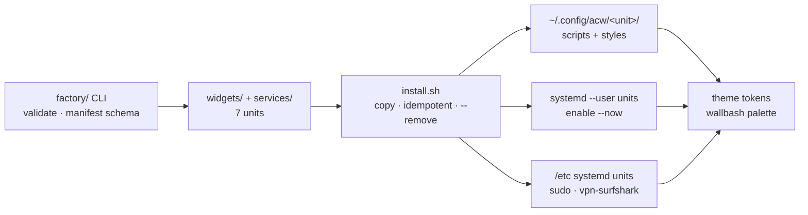

# ArchCustomWidgets

Factory of installable **widgets & services** that extend Caelestia (HyDE 3.x-based) on Arch Linux / Hyprland (Wayland). Spec-driven: every unit starts as an OpenSpec proposal → spec → factory scaffold → validated install.

## How it works



- **Copy, never symlinks** — plain file copies, idempotent, reversible (`--remove` leaves no trace).
- **No hardcoded colors** — every unit consumes the active wallbash/Caelestia palette.
- **Bash first** — no frameworks, no build step; python3 only as JSON helper.

## Units

| Unit | Type | What it does | Notes |
|---|---|---|---|
| `wallpaper` | service | Wallhaven downloader + rofi wallpaper selector + auto-theme pipeline (systemd `.path` → matugen + scheme set) | Keybinds `Ctrl+Super+T`, `Shift+Super+T`, `Ctrl+Shift+T` — wire manually |
| `scheme-rotator` | widget | Rotates the active color scheme | Keybind `Super+Alt+T` — wire manually |
| `waybar-power` | widget | Power menu module: lock / power / quit / reboot | |
| `waybar-theme` | widget | Theme switcher module for waybar | |
| `clipboard-rofi` | widget | Rofi clipboard manager | Keybind `Super+V` — wire manually |
| `vpn-surfshark` | service | Surfshark VPN quick-toggle (Caelestia quick-toggles `utilities.vpn`), `surfshark-connect`/`surfshark-disconnect` units | System-level files → sudo install. Known bug: fix reserved in change `fix-vpn-surfshark` |
| `quickshell-watchdog` | service | Watchdog for quickshell, systemd user unit + timer | |

## Quick start

```bash
# Validate every unit (widgets/ + services/)
factory/validate

# Install a unit (copies files into ~/.config; idempotent, backs up overwritten files)
cd <unit>
./install.sh

# Uninstall (removes exactly what it installed, leaves no trace)
./install.sh --remove
```

- System-level units (e.g. `vpn-surfshark`) run some install steps via `sudo` and prompt only for those.
- Install model is copy, never symlinks. Safe to re-run.

## Contract & docs

- [`AGENTS.md`](AGENTS.md) — unit contract + "done means 100% functional" validation checklist.
- `docs/archcustomwidgets.html` — full technical documentation (single-file, PDF-ready).
- `openspec/` — spec-driven lifecycle (specs, changes, archive). Active change: `fix-vpn-surfshark`.
